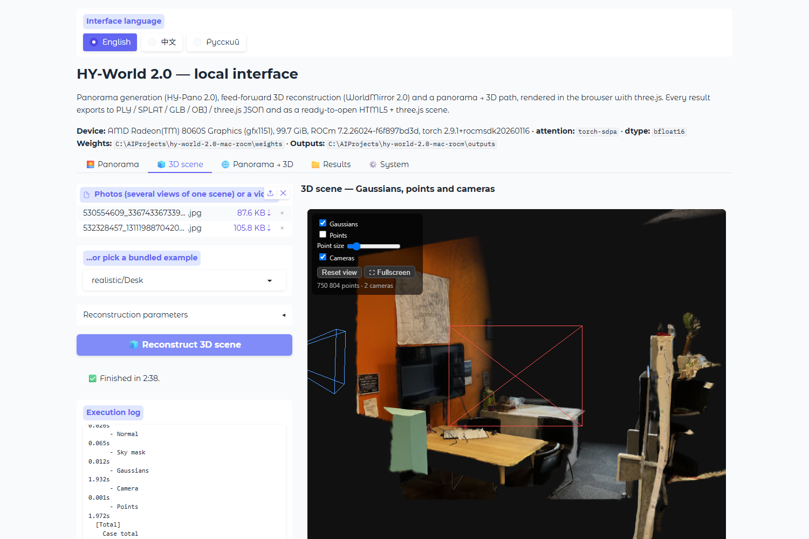
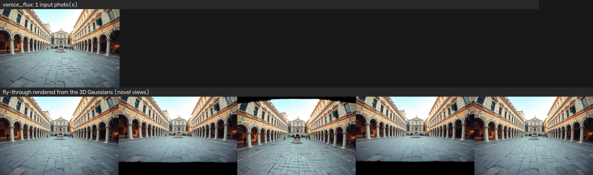
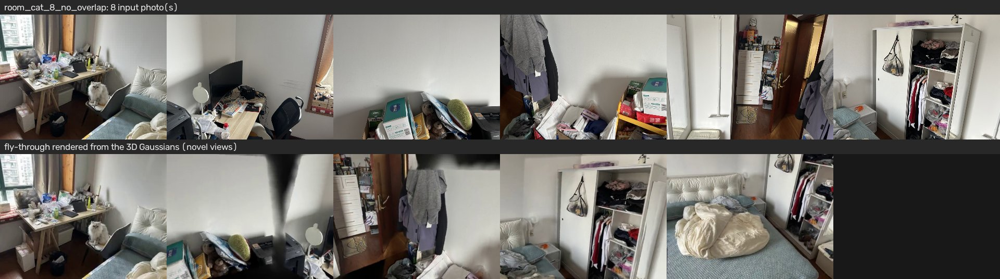
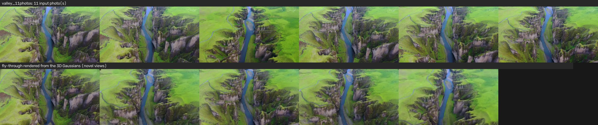
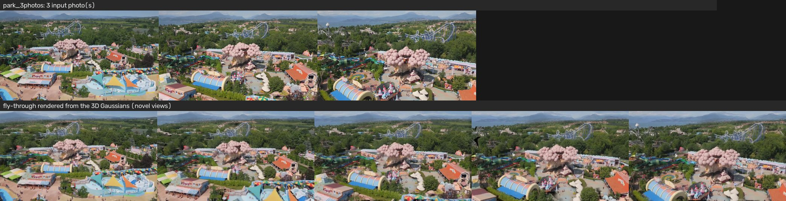
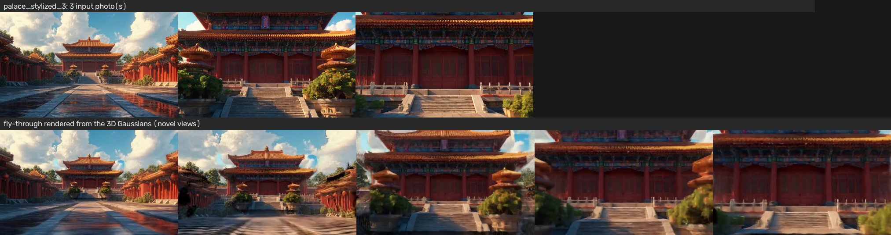
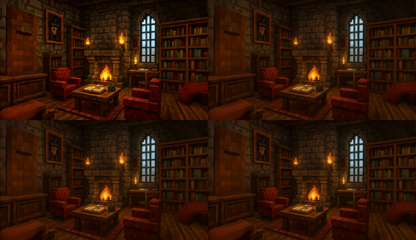

# HY-World 2.0 without CUDA — AMD ROCm (Windows / Linux) and Apple Silicon (MPS)

**Run Tencent's HY-World 2.0 on hardware it was never shipped for:** AMD GPUs through ROCm/HIP on Windows and Linux, and Apple Silicon through Metal Performance Shaders. No NVIDIA GPU, no Linux VM, no cloud, no CUDA.

HY-World 2.0 turns photos into 3D worlds. This repository ports it, adds a local web interface, and exports everything the models produce into formats other software can open: 3D Gaussian Splatting (`.ply`, `.splat`), point clouds (`.ply`, `.glb`, `.xyz`), a textured mesh (`.glb`, `.obj`), three.js JSON, and a **ready-to-open HTML5 + three.js scene**.

**Keywords:** HY-World 2.0, Hunyuan World, WorldMirror 2.0, HY-Pano 2.0, WorldStereo 2.0, 3D Gaussian Splatting, 3DGS, image to 3D, panorama, 360, AMD, ROCm, HIP, Radeon, Strix Halo, gfx1151, Ryzen AI Max, Mac, macOS, Apple Silicon, M1, M2, M3, M4, Metal Performance Shaders, MPS, PyTorch, three.js, glTF, Tencent.



---

## What works where

| | 3D reconstruction (WorldMirror 2.0) | Panorama (HY-Pano 2.0) | Panorama → 3D | Fly-through video (gsplat) | World expansion (WorldStereo 2.0) |
|---|---|---|---|---|---|
| **NVIDIA / CUDA** | ✅ upstream | ✅ upstream | ✅ | ✅ | ✅ upstream, multi-GPU |
| **AMD / ROCm, Windows** | ✅ **verified** | ✅ **verified** | ✅ **verified** | ✅ **verified** (HIP build) | ⚠️ runs end to end, slow, CLI only |
| **AMD / ROCm, Linux** | ✅ same code path | ✅ same code path | ✅ | ✅ | ⚠️ as above |
| **Apple Silicon / MPS** | ✅ **verified** | ⚠️ needs ≥ 64 GB unified memory, not run yet | ✅ **verified** | ❌ no Metal build of gsplat | ❌ |
| **CPU only** | ✅ (very slow) | ❌ impractical | ✅ (very slow) | ❌ | ❌ |

Everything marked *verified* was run on a **Radeon 8060S** (Ryzen AI Max+ 395 "Strix Halo", gfx1151, RDNA 3.5) under **Windows 11** with ROCm 7.2 and PyTorch 2.9.1 — an integrated GPU that AMD does not list as supported, which is about as unfavourable a target as this model gets. Linux/ROCm goes through exactly the same code (the compatibility layer detects HIP, not the operating system), but has not been run separately.

**About macOS.** Reconstruction and panorama → 3D were run end to end on an **Apple M4 Pro with 24 GB** of unified memory (macOS 26.6, PyTorch 2.14.0): the CLI, the web interface with its viewer, the Results tab and every export. Outputs match a CPU fp32 reference to a fraction of a percent, and it is quick — two photos at 952 px take 6 s of inference, the 32-view bundled example 70 s, with about 5.5 GB resident. What **cannot** be verified on that Mac is panorama generation itself: the base model alone is 54 GB in bf16, so it needs a 64 GB (better 96 GB) machine, and the panorama path stays code-complete-but-unrun on Metal. [`MPS_PORT.md`](HY-World-2.0/MPS_PORT.md) records what was run, what was found and fixed, and what is left; a panorama report from a large-memory Mac is very welcome.

### What the pieces are

HY-World 2.0 is Tencent's multi-modal *world model*: from a photo, a set of photos or a video it produces a 3D world as Gaussian splats plus depth, normals, cameras and a point cloud.

- **WorldMirror 2.0** — feed-forward reconstruction. One pass over 1–32 views, no per-scene optimisation: depth, surface normals, camera poses, a point cloud and 3D Gaussians in a couple of minutes.
- **HY-Pano 2.0** — one photo and a prompt → a 360° equirectangular panorama (a LoRA over Qwen-Image-Edit-2509).
- **Panorama → 3D** — this port's bridge between the two: the panorama is re-projected into a ring of pinhole views and handed to WorldMirror with the exact synthetic cameras as priors.
- **WorldStereo 2.0** — the *world expansion* stage that hallucinates what lies behind objects. Ported far enough to produce a real forward camera move with parallax on the reference machine, but at 42 minutes per clip it is an experiment, not a feature — see [`WORLDGEN_PORT.md`](HY-World-2.0/WORLDGEN_PORT.md).
- **WorldNav** (trajectory planning with a VLM, SAM 3, a navmesh) and the final **3DGS training** are not ported.

---

## Install

You need Python 3.11 or 3.12, git, and roughly 70 GB of disk for the full weight set (5 GB for reconstruction only).

### AMD on Windows

```bash
powershell -ExecutionPolicy Bypass -File scripts\install_rocm_windows.ps1
```

Creates `venv`, reuses a working ROCm PyTorch if one is importable (and otherwise installs AMD's nightly wheels for gfx1151 / gfx1200 / gfx1201), installs the port's dependencies, downloads the weights and the bundled example photos, then runs `scripts/doctor.py`. Options: `-ReconOnly` (skip the 55 GB of panorama models), `-SkipWeights`, `-InstallTorch`, `-NoExamples`.

For a GPU that is not in the nightly index, install torch by hand first from the index AMD lists for it at https://rocm.docs.amd.com/projects/radeon-ryzen/en/latest/ and re-run the script. Do **not** use the pytorch.org ROCm wheels on a ROCm 7.x runtime: they are built against ROCm 6.x and segfault on GPU memory access.

### AMD on Linux

```bash
chmod +x scripts/install.sh && ./scripts/install.sh
```

Picks the wheel index from `rocminfo` (`--install-torch` if none is present). Same options as above in lower-case form: `--recon-only`, `--skip-weights`, `--install-torch`, `--no-examples`.

### Apple Silicon

```bash
chmod +x scripts/install.sh && ./scripts/install.sh --recon-only
```

The default PyPI torch wheel includes MPS. `--recon-only` is the sensible default on a Mac with less than 64 GB of unified memory (see above). Verified with Python 3.12 (Homebrew) and torch 2.14.0 on macOS 26.6; the launchers and `hyworld2.compat` set `PYTORCH_ENABLE_MPS_FALLBACK=1` and lift the allocator's high-watermark cap for you. The low-precision dtype is **bf16** where Metal provides it (macOS 14+), `HYWORLD_MPS_DTYPE=fp16` switches it.

### By hand

```bash
python -m venv venv && source venv/bin/activate        # venv\Scripts\activate on Windows
pip install <the torch build for your hardware>        # see the notes above
pip install -r HY-World-2.0/requirements-rocm.txt      # torch-free; the name is historical
python download_weights.py --examples                  # --recon-only to skip the panorama models
python scripts/doctor.py
```

Never install upstream's `requirements.txt`: it pins `torch==2.7.1` and `numpy==1.26.4` and replaces a working ROCm or MPS stack with a CPU one.

### What gets downloaded

| | Size | Needed for |
|---|---|---|
| `weights/HY-WorldMirror-2.0` | 4.8 GB | 3D scene, panorama → 3D |
| `weights/HY-Pano-2.0` | 0.8 GB | panorama (the LoRA) |
| `weights/Qwen-Image-Edit-2509` | 54 GB | panorama (the base model the LoRA sits on) |
| `HY-World-2.0/examples/worldrecon` | 110 MB | the "bundled example" dropdown (upstream's demo photos, fetched with a sparse git clone) |
| `HY-World-2.0/skyseg.onnx` | 168 MB | sky removal; fetched automatically on the first reconstruction |
| Hugging Face cache, `python download_weights.py --worldgen` | 59 GB | the WorldStereo 2.0 experiment only |

---

## Run

```bash
./launch.sh
```

On Windows, either double-click **`HY-World 2.0.cmd`** or:

```bash
powershell -ExecutionPolicy Bypass -File launch.ps1
```

The browser opens on http://127.0.0.1:7860. Options on every launcher: `--port N`, `--host 0.0.0.0` (reach it from the LAN), `--device cpu` (force a backend, for bisecting), `--no-browser`.

### The interface

- **🌅 Panorama** — photo + prompt → 360° panorama, shown from inside a sphere. Runs in a separate process (`pano_worker.py`) so the 54 GB model is released when it finishes. Each generation reloads the model (~80 s); budget about **25 minutes** for 1952×960 at 40 steps on the reference GPU, or pick 1024×512 and fewer steps to iterate.
- **🧊 3D scene** — photos or a video (or a bundled example) → Gaussians, points, cameras, depth and normal maps, optional fly-through video. Two photos at 952 px take about **2.5 minutes** warm.
- **🌐 Panorama → 3D** — the last panorama (or any equirectangular image) → a relief-like 3D scene. The views are sliced from one point, so there is no parallax: expect a textured shell around the viewpoint, not a walkable world.
- **📁 Results** — every earlier run under `outputs/`, whether it came from the interface or the command line. Open one to view it again and export it.
- **⚙️ System** — memory figures and per-model unload.

Every tab has a **status line** above its log: the current stage, how long it has been there, a spinner that proves the job is still yielding, and the process's live CPU share. That last figure is the one that matters on ROCm: a run that is *busy but quiet* (MIOpen compiling kernels, a VAE pass) shows CPU near 100 %; a run that is genuinely stuck shows zero. A warning appears when nothing has been printed for 90 seconds, which is normal during the first run at a new resolution.

The interface is in **English / 中文 / Русский**; console logs stay in English.

### Export

Each result has an export panel. Pick a format, press **Export**, download.

| Format | File | Opens in |
|---|---|---|
| 3D Gaussian Splatting, as produced | `gaussians.ply` | any INRIA-layout viewer (see the opacity note below) |
| 3D Gaussian Splatting, compact | `scene.splat` | SuperSplat, the Unity / Unreal / Godot plugins, most web viewers |
| Point cloud | `points.ply`, `points.glb`, `points.xyz` | three.js, Blender, Godot, CloudCompare, MeshLab |
| Textured relief mesh | `mesh.glb`, `mesh_obj.zip` (OBJ + MTL + JPEG) | anything that opens a mesh: Blender, Unity, Unreal, Windows 3D Viewer, three.js |
| three.js JSON Object format | `scene.three.json` | `THREE.ObjectLoader().parse(json)` |
| Cameras | `camera_params.json` | intrinsics + camera-to-world matrices |
| **HTML5 + three.js scene, folder** | `scene_web.zip` | the viewer above, every layer including the Gaussians; double-click `Open scene (Windows).bat` / `(macOS).command` |
| **HTML5 + three.js scene, single file** | `scene.html` | opens straight from disk: mesh, points, cameras; the Gaussians appear once it is served over http |
| Everything | `scene_all.zip` | all of the above plus the depth / normal maps and the fly-through video |
| Panorama | `panorama.png` / `.jpg`, `cubemap.zip`, `panorama.glb`, `panorama.html`, `panorama_web.zip` | image editors; three.js `CubeTextureLoader` / skyboxes; any glTF viewer (an inward-facing textured sphere); a 360° viewer |

Notes that save time:

- **The mesh is built from the predicted depth maps**, one height field per view, textured with the input photo and cut along depth discontinuities and the sky mask. It is a relief, not a watertight model — but it is the one export that opens *everywhere*, and it lines up with the Gaussians in the viewer.
- **Why the HTML scene comes in two flavours.** Browsers refuse to read files next to a page opened as `file://`, so a page that references `scene/points.ply` cannot work from disk. The folder export therefore ships a 30-line `serve.py` (localhost only) and one-click launchers. The single-file export embeds everything as base64 and opens with a double-click; the splat sorter needs a Web Worker, which browsers do not grant to `file://` pages, so that one shows the mesh, points and cameras until it is served over http.
- **Coordinate frames.** WorldMirror works in the OpenCV convention (x right, y down, z forward) and `gaussians.ply` / `points.ply` / `scene.splat` / `camera_params.json` keep it, so they stay interchangeable with the 3DGS tool chain. glTF, OBJ and three.js are y-up, so `mesh.glb`, `points.glb`, the OBJ and the three.js JSON are rotated 180° about x (forward lands on −z, as glTF expects).
- **An opacity quirk in upstream's `.ply`.** WorldMirror writes its opacities *after* the sigmoid, whereas the INRIA layout stores logits; every standard viewer applies the sigmoid again and renders the `.ply` too translucent. The viewer here shows `scene.splat`, which carries the true alpha (and is half the size). Export the `.splat` for other viewers unless they need the `.ply` specifically.
- **A cube map is a three.js cube map.** Six faces in `CubeTextureLoader` order, mirrored the way three.js samples a skybox from the inside, so it shows exactly what `EquirectangularReflectionMapping` shows for the same panorama — checked side by side in the browser.

The same exports are available from the command line on any result directory, including ones the CLI pipelines produced:

```bash
python export3d.py outputs/ui/recon_20260905_190206/result --all
python export3d.py outputs/ui/pano_20260905_180000/panorama.png -f cubemap -f web_html
```

### Command line

```bash
cd HY-World-2.0
./scripts/run_worldrecon.sh examples/worldrecon/realistic/Desk --save_rendered
./scripts/run_panogen.sh /absolute/path/to/photo.jpg --num-inference-steps 40
```

Both source `scripts/rocm_env.sh`; every Python entry point also imports `hyworld2.compat`, so the runtime settings apply either way. **Stop the web UI first**: only one HIP process may use an APU at a time (a second one segfaults).

### Check the install

```bash
python scripts/doctor.py
```

Reports backend, attention path, dtype, which weights are present, whether gsplat is built, memory — and verifies that the GPU still returns correct arithmetic, which is not paranoia on this hardware: after a driver reset the GPU keeps running and quietly returns wrong numbers.

`tools/ui_smoke.py` goes further: it drives the running web UI in a real (headless) browser through all three flows and one export each, and takes the screenshots in `assets/`. It needs `pip install playwright && python -m playwright install chromium`.

---

## Examples

Reconstructions on the Radeon 8060S. Top row of each sheet: the input photo(s); bottom row: frames of the fly-through rendered from the resulting 3D Gaussians, i.e. **views no camera ever saw**. Inference is the wall-clock time of the model pass at 952 px, `bf16`, with the kernel cache warm.

| Scene | Inputs | Inference | Gaussians |
|---|---|---|---|
| Venice square (a generated photo) | 1 | 82 s | 227 k |
| Office | 1 | 74 s | 316 k |
| Stylised palace | 3 | 295 s | 91 k |
| Park | 3 | 460 s | 785 k |
| Room with a cat, 8 photos with **no overlap** between them | 8 | 431 s | 1.13 M |
| Valley | 11 | 798 s | 1.28 M |

**One photo is enough for a scene you can look around in** — the fly-through moves the camera sideways and the arcades, the fountain and the far façade separate with correct parallax.



**Eight photos of a room, deliberately taken so that no two overlap.** Feed-forward reconstruction has no correspondence step to fail; WorldMirror places the views by what it knows about rooms.



**Eleven photos of a valley** — the largest of the set, 1.28 M Gaussians.



**Three photos of a park**, thin trunks and foliage — the hard case for any depth model.



**Stylised input** reconstructs as readily as photographs.



**World expansion (WorldStereo 2.0), the experiment.** Four keyframes of a 21-frame clip generated from a single reference image and *no* point-cloud guidance: the camera dollies forward, the fireplace grows, the shelves part at the edges and the geometry holds together between frames. This is novel-view synthesis with real parallax — the thing the single-point panorama → 3D path cannot do — and the reason the stage was worth porting despite its cost.



### What makes a good input

For reconstruction: photos of one scene taken from different positions, in the order they were taken, 2–32 of them, sharp, with the same aspect ratio. Overlap helps but is not required. A video works too (frames are sampled for you). For the panorama: a photo with a clear horizon and a prompt that describes what lies *outside* the frame.

---

## Measured on a Radeon 8060S (gfx1151, Windows 11, ROCm 7.2, PyTorch 2.9.1)

| Step | Setting | Time |
|---|---|---|
| Reconstruction, 2 photos | 714×952, bf16, warm | **156 s** (407 s cold: MIOpen compiles a kernel per convolution shape) |
| Reconstruction, model load | | 10–14 s |
| Panorama → 3D, 8 views at 768 px with camera priors | from the UI, kernel cache warm | **9.2 min** (540 s inference, 1.5 M Gaussians) |
| Fly-through render (gsplat, HIP) | 2 views, 15 interpolated frames | ~4 s |
| Panorama, denoising | 1952×960, 40 steps | **~25 min** (~38 s / step) |
| Panorama, model load | 54 GB base, from disk | 78 s |
| Panorama, whole run from the UI | 1024×512, 20 steps, model reloaded | **11.2 min** (27 s / step) |
| WorldStereo 2.0, one clip | 480×832, 21 keyframes, 4 DMD steps | 42.6 min |
| Attention, `(1, 16, 4096, 64)` bf16 | AOTriton flash vs MATH | 4.8 ms vs 62.3 ms (**13×**) |
| Dense matmul | bf16 / fp16 / fp32 | 34.5 / 37.8 / 3.0 TFLOP/s |

Peak GPU memory: reconstruction 13.7 GB; panorama **58.4 GB** regardless of output size, so it needs a GPU (or unified-memory carve-out) of 64 GB, and about 64 GB of host RAM to stage the model through.

## Measured on an Apple M4 Pro (24 GB unified memory, macOS 26.6, PyTorch 2.14.0)

| Step | Setting | Time |
|---|---|---|
| Reconstruction, 2 photos | 714×952, bf16 | **6.0 s** inference, 9 s with masks and saving |
| Reconstruction, 11 photos (Valley) | adaptive 378×672, bf16 | 14 s inference, 1.3 M Gaussians |
| Reconstruction, 32 photos (Park_Stone) | adaptive 504×504, bf16 | 70 s inference, 1.2 M Gaussians |
| Reconstruction, model load | | 6–10 s |
| Panorama → 3D, 8 views at 768 px with camera priors | from the UI | **37 s** (28 s inference, 2.0 M Gaussians) |
| Reconstruction, 2 photos at 518 px, CPU fp32 reference | `HYWORLD_DEVICE=cpu` | 39 s |
| Attention, `(1, 16, 4096, 64)` | Metal SDPA, bf16 / fp16 / fp32 | 12.6 / 12.6 / 15.8 ms |
| Dense matmul, 4096³ | bf16 / fp16 / fp32 | 6.0 / 6.0 / 5.5 TFLOP/s |

Resident memory stays around **5.5 GB** for every reconstruction above; there is no GPU/host split on Apple Silicon, the process simply grows. Against a CPU fp32 run of the same photos the bf16 result differs by 0.14 % mean relative depth error, 0.3° mean normal angle and under 0.25° in the recovered camera rotations; fp16 is 0.44 % / 0.2° / 0.12°. bf16 is the default because it is the dtype the model was trained and verified in, and Metal runs it at the same speed as fp16 here.

**Strix Halo owners:** the 128 GB is split in the BIOS between a dedicated-VRAM carve-out and system RAM, and the default split is often wrong for this workload. Weights are staged through *host* RAM on the way to the GPU; with 96 GB carved out for VRAM and 32 GB left for Windows, the 54 GB panorama base lived in the page file and every step looked like a hang. **64 GB / 64 GB** runs everything here. `torch.cuda.get_device_properties().total_memory` reports the carve-out plus GTT and is *not* the host budget.

---

## What the port changes, and why

Beyond replacing hardcoded `cuda` strings. Every item is written up with measurements in [`ROCM_PORT.md`](HY-World-2.0/ROCM_PORT.md) and [`WORLDGEN_PORT.md`](HY-World-2.0/WORLDGEN_PORT.md); this is the short list.

- **A shared compatibility layer** — [`hyworld2/compat/`](HY-World-2.0/hyworld2/compat) — decides device, dtype, autocast and attention once, for ROCm, MPS, CUDA and CPU alike. `compat.describe()` tells you what it chose.
- **Attention without FlashAttention.** Upstream imports FlashAttention-2/3 unconditionally; neither builds for RDNA. The port dispatches to `scaled_dot_product_attention` and, on ROCm, sets `TORCH_ROCM_AOTRITON_ENABLE_EXPERIMENTAL=1` — without that flag PyTorch silently drops to the MATH backend, 13× slower and quadratic in memory, and nothing fails loudly.
- **The MIOpen Conv3d cliff, folded away.** Both video VAEs in the pipeline (Qwen-Image's and Wan's) are built from causal 3D convolutions, and MIOpen's solver choice for those on gfx1151 depends on the exact spatial shape: ordinary photo aspect ratios land on a kernel **60× slower** than the good case and the run looks hung inside one convolution. [`conv3d_fold.py`](HY-World-2.0/hyworld2/compat/conv3d_fold.py) and [`conv3d_unroll.py`](HY-World-2.0/hyworld2/compat/conv3d_unroll.py) rewrite them as exactly equivalent 2D convolutions (verified against an fp32 reference: PSNR 38.8 dB either way, worst relative error 1e-6 in fp32). The Wan VAE went from 177.6 s to 5.5 s for a 21-frame encode, **32×**.
- **VAE tiling only where it helps.** Tiling is a 37× pessimisation for the encode and the thing that keeps the decode's peak memory bounded; [`vae_tiling.py`](HY-World-2.0/hyworld2/compat/vae_tiling.py) enables it for one direction only.
- **An honest progress bar.** The denoising loop never synchronises, so tqdm raced to 40/40 in 30 s and the whole cost landed on the first synchronising call afterwards, which looked exactly like a hang. `sync_each_step` makes the bar describe work actually done.
- **gsplat on HIP.** The CUDA rasterizer builds for ROCm — including on Windows, where `torch.utils.cpp_extension` misdetects `ROCM_HOME` with the `rocm-sdk` wheels, sends host `.cpp` files to MSVC, and lacks rocThrust and glm entirely. Thirteen distinct problems, all solved in [`setup.py`](HY-World-2.0/hyworld2/worldgen/third_party/gsplat_maskgaussian/setup.py) and [`Utils.cuh`](HY-World-2.0/hyworld2/worldgen/third_party/gsplat_maskgaussian/gsplat/cuda/include/Utils.cuh) behind `USE_ROCM`; the CUDA path is untouched. Build with `tools/build_gsplat_rocm.bat` after `tools/setup_rocm_thirdparty.sh`.
- **Single-process stand-ins for `torch.distributed`**, which the Windows ROCm build lacks entirely: a barrier over one rank is a no-op, an all-gather is a copy, and the collectives that cannot mean anything on one rank raise a sentence instead of returning nonsense.
- **Streaming checkpoint loading.** Upstream's sequence for the 17.4 B-parameter WorldStereo transformer peaks near 70 GB of host RAM. Building on the `meta` device and assigning one tensor at a time straight to the GPU needs **0.6 GB**.
- **MIOpen's cache in one place.** The expensive solver search was being paid twice, once per entry route; `configure_rocm_env()` pins the paths and `tools/merge_miopen_findb.py` folds an orphaned database into the canonical one.
- **The web UI, the panorama → 3D bridge, and the exports** are new; none of it touches the model.

Two ROCm facts worth carrying around: `channels_last` is **500× slower** than NCHW on gfx1151 in every dtype (do not add it anywhere), and fp32 convolutions run at a tenth of bf16's speed, so `--enable_bf16` is the difference between usable and not.

---

## Project layout

```
hy-world-2.0-mac-rocm/
├── gradio_app.py            ← the trilingual web UI (panorama, 3D scene, panorama → 3D, results, system)
├── export3d.py              ← every export format; also a CLI
├── pano3d.py                ← equirectangular → ring of pinhole views + camera priors
├── pano_worker.py           ← panorama generation in a process of its own
├── download_weights.py      ← Hugging Face weights, bundled examples, the WorldStereo stack
├── launch.sh / launch.ps1 / HY-World 2.0.cmd
├── viewer/index.html        ← three.js + GaussianSplats3D viewer; embedded in the UI and shipped in HTML exports
├── scripts/
│   ├── install_rocm_windows.ps1, install.sh   ← installers
│   └── doctor.py                              ← installation check
├── tools/                   ← benchmarks and probes behind the numbers in the port notes; gsplat build helpers
├── assets/                  ← screenshot and example sheets
├── HY-World-2.0/            ← upstream at df9988e with the port's changes (see NOTICE)
│   ├── hyworld2/compat/     ← the device / attention / Conv3d / distributed / loading layer
│   ├── scripts/             ← rocm_env.sh, run_worldrecon.sh, run_panogen.sh
│   ├── requirements-rocm.txt
│   └── ROCM_PORT.md, MPS_PORT.md, WORLDGEN_PORT.md   ← the engineering record
├── LICENSE                  ← Tencent HY-World 2.0 Community License (model and upstream code)
├── LICENSE-WRAPPERS         ← MIT (the files listed in it)
└── NOTICE                   ← Tencent notice + this port's statement of changes
(after install, none of it tracked)
├── venv/, weights/, outputs/, third_party_rocm/, HY-World-2.0/examples/
```

---

## Known limitations

- **gfx1151 is not in AMD's support matrix.** It works with the TheRock nightly wheels, which ship native gfx1151 kernels (no `HSA_OVERRIDE_GFX_VERSION` needed) — but they are nightlies.
- **First run at a new resolution is slow on ROCm** while MIOpen searches for convolution kernels: minutes of one CPU core at 100 % with nothing printed. It is paid once per shape; the cache lives in `~/.cache/miopen`.
- **One HIP process at a time on an APU.** A second PyTorch process against the same iGPU segfaults. Stop the UI before running a CLI pipeline.
- **Panorama → 3D has no parallax** by construction; it is a preview of what the unported world-generation stages would fill in.
- **WorldStereo 2.0 is slow and CLI-only:** 42.6 min per clip. Roughly 70 % of the transformer block's time at 32 k tokens is in neither attention nor the matmuls, and that profiling is the open problem. Stages 1–2 need SAM 3 and therefore `transformers ≥ 5`, which shares an interpreter with the verified panorama path — hence the pin below 5 for now.
- **The `.pyd` from the gsplat build is not shipped**; build it yourself (MSVC Build Tools on Windows, hipcc on Linux). Reconstruction does not need it — only the fly-through video does.
- **Windows extracts video frames into `C:\tmp`** (upstream hardcodes `/tmp`); the UI copies them next to the run so the mesh export can texture them.
- **Panorama generation on Apple Silicon is unverified**: it needs ~58 GB resident and the available Mac has 24 GB. Reconstruction and panorama → 3D are verified (see above).
- **A CLI run on MPS can crash while exiting** (`libc++abi: recursive_mutex lock failed`), seen once after a 32-view reconstruction with all results already written. The pipeline now drains the device before the interpreter tears down; if it recurs, the outputs are intact.

## Troubleshooting

- **"CPU 100 %, nothing printed for minutes"** during the first run — MIOpen searching. Check that `~/.cache/miopen/gfx*_*.ufdb.txt` is growing; if it is, wait. If it is static and the stage is a VAE, you have found a convolution shape that falls off the cliff: file an issue with the input size.
- **"CPU 0 %, still running"** — a real stall, usually memory: check the Windows commit charge (`\Memory\Committed Bytes`), not just "VRAM". A force-killed ROCm process can leave its commit behind.
- **Segfault (exit 139) while loading a checkpoint** — near the commit limit, or a second HIP process. Close other GPU processes (a `llama-server` holds ~31 GB of commit on this box).
- **`HIP out of memory` while the driver says memory is free** — the OS cannot commit it. Host RAM is the budget.
- **Panorama looks stuck after 40/40** — it is decoding; a 1952×960 run takes ~25 minutes in total. The status line's stage says which.
- **Attention warning "Flash Efficient attention on Current AMD GPU is still experimental"** — the flag was not set; launch through the launchers or `scripts/rocm_env.sh`.
- **`No module named gsplat`** — expected unless you built it; only the fly-through video needs it.
- **`enable_model_cpu_offload` segfaults** on ROCm/Windows (access violation in `c10.dll`); leave the panorama's CPU offload unchecked.

---

## Credits and upstream

Model and original research are by **Tencent Hunyuan**. This port adds no model capability; it exists to make HY-World 2.0 run without CUDA, and to get its results into other software.

- Upstream: https://github.com/Tencent-Hunyuan/HY-World-2.0
- Weights: https://huggingface.co/tencent/HY-World-2.0
- Technical report: https://arxiv.org/abs/2604.14268
- Viewer: three.js and [GaussianSplats3D](https://github.com/mkkellogg/GaussianSplats3D) by Mark Kellogg

Sibling projects by the same author: [Hunyuan3D 2.1 for MPS and ROCm](https://github.com/VladimirTalyzin/hunyuan3d-2.1-mac-rocm), [MOSS-SoundEffect for MPS and ROCm](https://github.com/VladimirTalyzin/MOSS-SoundEffect_v2.0_MPS_ROCm).

---

## License — please read before using

This repository contains **two separately-licensed layers**:

1. The Tencent HY-World 2.0 model, weights, the upstream code under `HY-World-2.0/`, the modifications made to it, and any output you generate are governed by the **TENCENT HY-WORLD 2.0 COMMUNITY LICENSE AGREEMENT** — see [`LICENSE`](./LICENSE).

   - **Territory:** the licence does **not** apply in the **European Union, the United Kingdom, or South Korea**. If you are in one of those jurisdictions you may not use the model under it.
   - **Commercial threshold:** above **1 million monthly active users** you need a separate licence from Tencent.
   - **Acceptable use:** the licence's use restrictions travel with the work and its outputs; you may not use outputs to improve other AI models.
   - **State your changes:** every modification this port makes to upstream files is enumerated in [`NOTICE`](./NOTICE), together with the upstream commit it is based on.

2. The wrapper code — the files listed in [`LICENSE-WRAPPERS`](./LICENSE-WRAPPERS): the UI, the exports, the compatibility layer, the scripts and the documentation — is **MIT-licensed**.

This project is **not** affiliated with, endorsed by, or sponsored by Tencent. "Tencent HY" is a trademark of Tencent. The provider of this software is Vladimir Talyzin.

---

## Contributing

Issues and PRs welcome — especially:

- **Panorama generation on a Mac with 64 GB or more.** Reconstruction is verified on a 24 GB M4 Pro; the HY-Pano path has not been run on Metal. `MPS_PORT.md` says what to run and what to look at.
- **Linux/ROCm confirmation** on discrete Radeon cards.
- **The WorldStereo block profile** — where the missing 70 % goes at 32 k tokens.
- **Stages 1–2 and 5** of world generation, once `transformers ≥ 5` can be tested against the panorama path.
- Additional UI translations.

Keep PRs scoped to the wrapper files and to `hyworld2/compat/`; changes to upstream model code should be minimal and listed in `NOTICE`.
